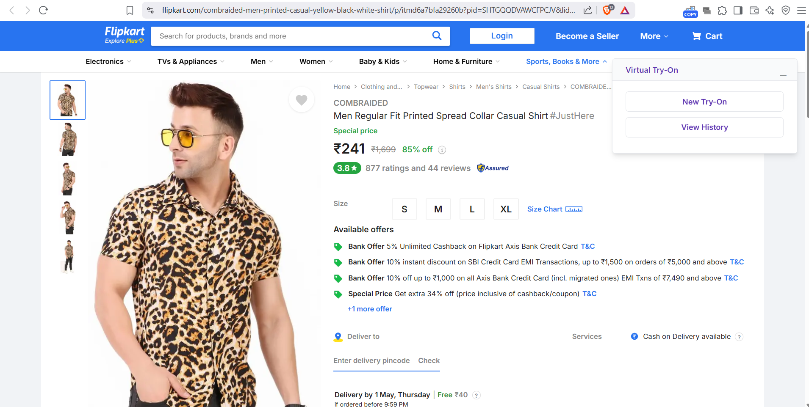
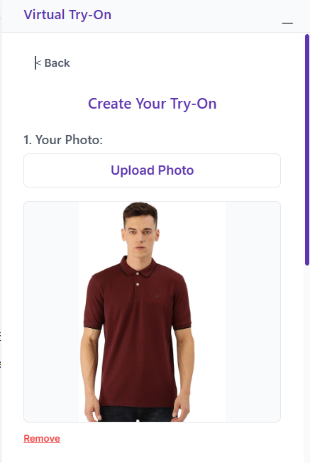
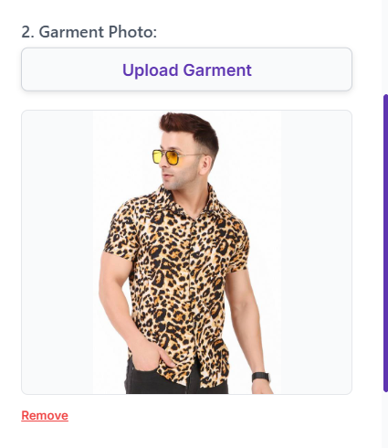
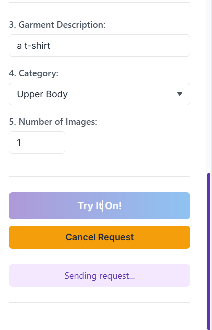
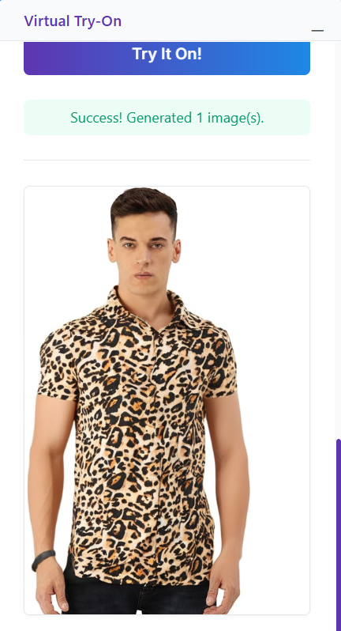
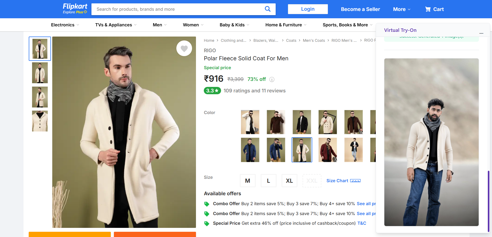
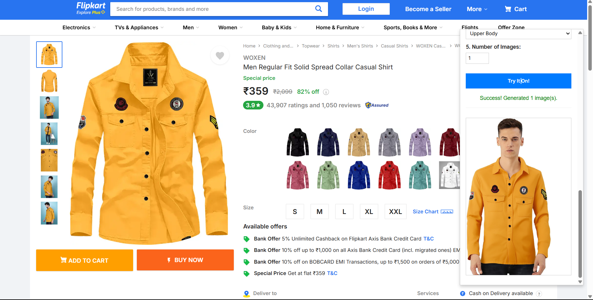

# 🚀 VTON: The Future of Online Shopping 🛍️

Welcome to the official repository for the **Virtual Try-On (VTON) Web Extension**! This project is designed to revolutionize the way you shop for clothes online, bringing the fitting room directly to your screen.

[](https://www.python.org/)
[](https://www.javascript.com)

### Problem 🤔
Ever hesitated to buy a shirt or a dress online because you weren't sure how it would look on you? The endless cycle of buying, waiting, trying on, and returning is a hassle.

### Solution ✨
Our browser extension integrates seamlessly with e-commerce sites like Flipkart, allowing you to **upload your photo** and **virtually try on any piece of clothing** in just a few clicks!

---

## 📂 Project Structure

Here's a look at how the project is organized:

```
VTON/
│
├── 📁 Front-End/
│   └── 📁 Virtual Try-On/
│       ├── 🖼️ icons/
│       ├── 📄 manifest.json
│       ├── 📜 pop.js
│       ├── 📜 popup.html
│       ├── 📜 start.js
│       ├── 🎨 style.css
│       └── 🎨 widget_style.css
│
├── 📁 Back-End/
│   ├── 📝 any2any_VTON.ipynb
│   ├── 📝 catVTON.ipynb
│   └── 📝 IDM_VTON.ipynb
│
└── 📁 Research-Paper/
    └── 📄 VTON_Research_Paper.pdf
```

---

## 🌟 Core Features

*   **🛒 Seamless E-commerce Integration:** Works directly on websites like Flipkart.
*   **🤳 Personalized Experience:** Upload your own photo for a realistic preview.
*   **🖱️ Simple Drag-and-Drop:** Effortlessly select clothes from the product page.
*   **⚙️ Smart Customization:** Fine-tune the results by specifying garment type (e.g., upper body, lower body).
*   **⚡ Instant Generation:** Click "Try-On" and let our powerful back-end work its magic.
*   **📚 History Saver:** Keep track of all the outfits you've virtually tried on.

---

## 🚀 How It Works: A Step-by-Step Guide

#### 1. Start the Extension 🎉
Open the extension on a supported product page to begin.
<br>


#### 2. Upload Your Photo 👩‍💻
Choose a clear, front-facing picture of yourself.
<br>


#### 3. Drag, Drop, and Go! 👕
Drag the image of the clothing item you want to try into the extension window.
<br>


#### 4. Fill in the Details ✍️
Specify the clothing category and a brief description for the best results.
<br>


#### 5. Click Try-On & See the Magic! ✨
Hit the "Try-On" button and watch as the extension generates your virtual fitting.
<br>


#### 6. Save Your Favorites ❤️
Your try-on history is automatically saved for you to review later.
<br>


---

## 📸 Live in Action!

Here are a couple more examples of what our VTON extension can do:

| Example 1 | Example 2 |
| :---: | :---: |
|  |  |

---

## 💻 Tech Stack

This project is built with a modern tech stack to ensure a robust and user-friendly experience.

### 🌐 Front-End (The Extension)
*   **HTML5:** `popup.html`
*   **CSS3:** `style.css`, `widget_style.css`
*   **JavaScript:** `pop.js`, `start.js` for interactivity and API calls.
*   **Manifest V3:** `manifest.json` for the web extension setup.

### 🤖 Back-End (The Brains)
*   **Gradio:** To create and serve the user interface for our models.
*   **Python:** The core language for our machine learning models.
*   **Jupyter Notebooks:** For developing and testing the VTON models:
    *   `any2any_VTON.ipynb`
    *   `catVTON.ipynb`
    *   `IDM_VTON.ipynb`

---

## 📜 Research Paper

To support this project, we conducted an in-depth academic study to evaluate the performance and cost-effectiveness of various VTON models.

**Title:** *A Comprehensive Feasibility Study of Virtual Try-On for Online Shopping: Benchmarking Model Performance and Cost-Effectiveness*

**Abstract:**
> Virtual Try-On (VTON) technology has great potential to transform the online clothing shopping experience by solving fit and visual representation-related challenges, thus potentially lowering product returns. But large-scale adoption depends on the practicality of implementing these systems, taking into account the interaction between image generation quality, computational resource needs, and operating expenses. This work provides an extensive feasibility study, comparing five leading VTON models: Leffa, Any2Any, FitDiT, CatVTON, and IDM-VTON. They cover varied architectures such as Stable Diffusion variants (1.5, XL, SD3-like) and FLUX. We examine their VRAM requirements and performance characteristics on common GPU tiers (16GB to 80GB+). Quality is measured in terms of reported Frechet Inception Distance (FID) scores on benchmarking datasets (VITON-HD, DressCode), where Leffa and FitDit attain top objective fidelity. Performance metrics such as inference time and throughput, and the effect of optimizations such as quantization and offloading are analyzed. Cost-effectiveness is measured in terms of per-image generation cost estimation based on cloud GPU costs. The results present the different feasibility profiles: CatVTON has large throughput and economical cost on medium-range hardware, IDM-VTON has flexibility on tiers through optimisation, but Leffa and FitDit have objective-quality leading but use high-end GPUs and are also more expensive. This analysis delivers quantitative insights for retailers to adopt VTON solutions based on the quality goal desired, budget available, and desired scale.

You can read the full paper here: `Research-Paper/VTON_Research_Paper.pdf`

---

Happy Shopping! 🥳
